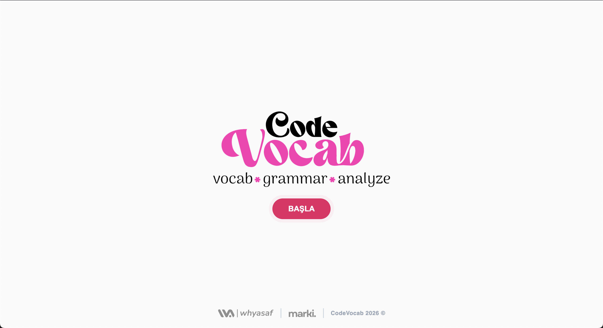
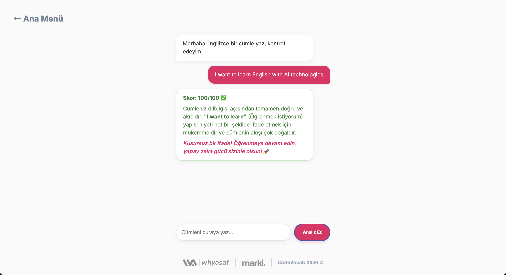

#  CodeVocab: AI-Powered English Learning Assistant


**CodeVocab**, sıradan kelime ezberleme yöntemlerini **Google Gemini AI** teknolojisiyle birleştirerek size özel, dinamik ve akıllı bir İngilizce öğrenme deneyimi sunar. 

Statik listeler yok, tekrar eden sıkıcı alıştırmalar yok. Sadece siz ve sizin seviyenize göre anlık üretilen içerikler var.

---

##  Öne Çıkan Özellikler

* **🧠 Gemini AI Motoru:** A1 - B1 - C1 seviyesine uygun kelimeleri ve bağlamları yapay zeka anlık olarak üretir.
* **⚡ Canlı Cümle Analizi:** Yazdığınız cümleleri gramer, anlam ve bağlam açısından saniyeler içinde analiz eder ve puanlar.
* **🎯 Kişiselleştirilmiş Deneyim:** Ezberci eğitim yerine, pratik yaparak öğrenmeye odaklanır.
* **🎨 Modern Arayüz:** Kullanıcı dostu, responsive ve şık tasarım.

---

##  Projeden Görüntüler

| **Ana Ekran (Dashboard)** | **AI Analiz Sonucu** |
|:---:|:---:|
|  |  |


---

##  Kullanılan Teknolojiler

Bu proje, en güncel ve güçlü teknolojiler kullanılarak geliştirilmiştir:

* 
* 
* 
* 

---

##  Kurulum (Local'de Çalıştırmak İçin)

Projeyi kendi bilgisayarınızda incelemek isterseniz:

1.  **Projeyi Klonlayın:**
    ```bash
    git clone [https://github.com/whyasaf/CodeVocab.git](https://github.com/whyasaf/CodeVocab.git)
    cd CodeVocab
    ```

2.  **Gereksinimleri Yükleyin:**
    ```bash
    pip install -r requirements.txt
    ```

3.  **API Anahtarınızı Ekleyin:**
    `.env` dosyası oluşturup kendi Google Gemini API anahtarınızı ekleyin:
    ```env
    GOOGLE_API_KEY=Sizin_API_Anahtarınız
    ```

4.  **Çalıştırın:**
    ```bash
    python app.py
    ```

---

##  Geliştirici

**Whyasaf** tarafından tasarlanmış ve kodlanmıştır.
*Copyright © 2026 CodeVocab*
