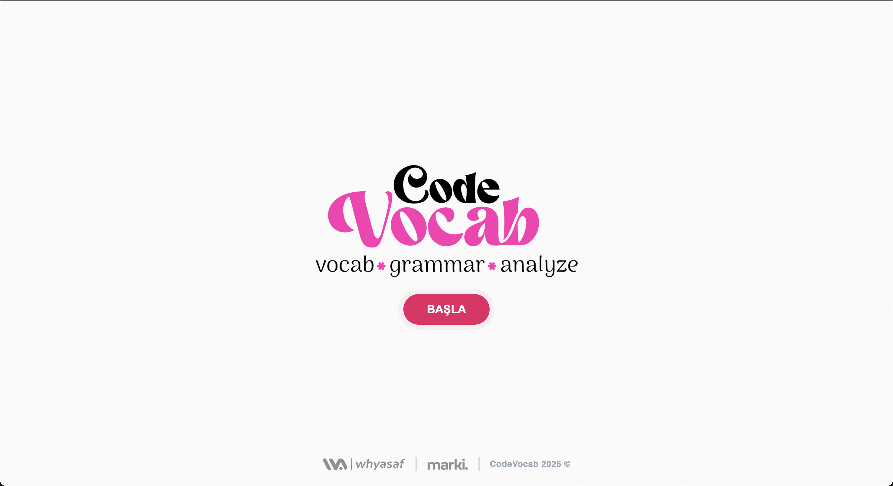
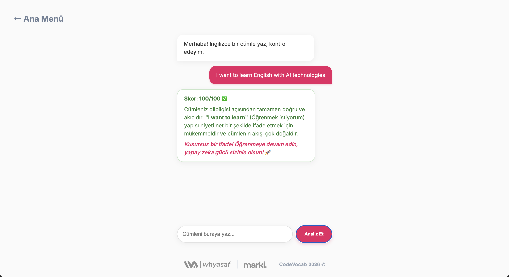

# 🚀 CodeVocab: AI-Powered Dynamic English Learning Assistant


**CodeVocab**, statik kelime listelerini ve klasik ezber yöntemlerini çöpe atan, gücünü **Google Gemini AI** modelinden alan dinamik bir dil öğrenme asistanıdır.

Sıradan uygulamaların aksine, CodeVocab size önceden hazırlanmış cümleler sunmaz; her kelimeyi ve analizi o anki seviyenize göre **gerçek zamanlı** üretir.

---

## ✨ Öne Çıkan Özellikler

- **🧠 Intelligent Vocabulary Hunter:** Rastgele seçilen kelimeler için AI tarafından anlık üretilen A1, B1 ve C1 seviyesinde bağlamsal örnek cümleler.
- **⚡ Smart Sentence Analyzer:** Kendi kurduğunuz İngilizce cümleleri gramer, doğallık ve bağlam açısından 100 üzerinden puanlayan ve hataları Türkçe açıklayan yapay zeka mimarı.
- **💾 Local-First Persistence:** Kullanıcı gizliliği ön planda! Öğrenilen kelimeler ve ilerleme verileri hiçbir sunucuya kaydedilmez, tamamen tarayıcınızın `LocalStorage` alanında saklanır.
- **📱 Responsive Design:** Inter font ailesi ve minimalist UI yaklaşımıyla tüm cihazlarda kusursuz deneyim.

---

## 🛠 Kullanılan Teknolojiler

| Kategori       | Teknoloji                                  |
| :------------- | :----------------------------------------- |
| **Backend**    | Python 3.11, Flask                         |
| **AI Engine**  | Google Gemini 1.5 Flash API                |
| **Frontend**   | Vanilla JS, CSS3 (Modern Flex/Grid), HTML5 |
| **Deployment** | Vercel (Serverless Functions)              |

---

## 📸 Projeden Görüntüler

|     **Kelime Avcısı Modülü**     |          **AI Cümle Analizi**           |
| :------------------------------: | :-------------------------------------: |
|  |  |

---

## 🚀 Kurulum ve Çalıştırma (Local)

Projeyi kendi bilgisayarınızda ayağa kaldırmak için:

1.  **Repoyu Klonlayın:**

    ```bash
    git clone [https://github.com/whyasaf/CodeVocab.git](https://github.com/whyasaf/CodeVocab.git)
    cd CodeVocab
    ```

2.  **Bağımlılıkları Yükleyin:**

    ```bash
    pip install -r requirements.txt
    ```

3.  **Environment Variables:**
    Ana dizinde bir `.env` dosyası oluşturun ve Gemini API anahtarınızı ekleyin:

    ```env
    GEMINI_API_KEY=YOUR_API_KEY_HERE
    ```

4.  **Uygulamayı Başlatın:**
    ```bash
    python app.py
    ```

---

## ⚖️ Lisans ve Gizlilik

Bu proje **whyasaf** tarafından portfolyo ve eğitim amacıyla geliştirilmiştir. Kullanıcı verileri sunucu tarafında saklanmaz; tüm analiz süreçleri Google Gemini API üzerinden anlık olarak gerçekleşir. Detaylı bilgi için uygulama içindeki **Gizlilik Politikası** sayfasını ziyaret edebilirsiniz.

---

## 👨‍💻 Geliştirici

**Whyasaf** tarafından tasarlanmış ve kodlanmıştır.  
[LinkedIn](https://www.linkedin.com/in/omer-asaf-ak/) | [Website](https://whyasaf.com)
